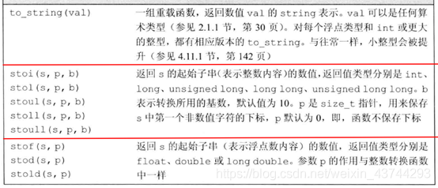
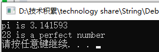
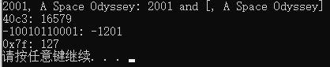

# 刷算法题总结

## 数组

### 【深基5.例7】工艺品制作 | P5729

第一次错误：范围1< w,x,h <= 20数组大小设置错误设置为了20所以会有RE(RuntimeError)

### [AHOI2001] 彩票摇奖 | P2550

第一次暴力实现4ms暴力实现
其实可以使用号码作为分数下标这样可以快速查找到是否是中奖号码。

第二次用号码作为下标 仍然是4ms改进不大，但是第二次写
把

```C++
int **a=new int *[n];
cin>>n;
```

顺序写反了导致一直RE很难找到错误

### P5730 【深基5.例10】显示屏

看题不仔细，输入输出的格式要仔细看
输出的是大写的X并且其中没有空格，要仔细看
本题没有什么难度和算法

### 梦中的统计 | P1554

一次过

#### 学到新知识：stoi、to_string


注意：

1. std::to_string()有9种重载形式，分别对应int/long /long long/unsigned/unsigned long/unsigned long long/float/double/long double。
2. b默认值为10，即10进制；若b = 0，则表示自动确定string序列的基数，如0x7f会自动以16进制为基数。
3. 对于转换为浮点型的字符串(上述表格的最后3个)，可以识别小数点和指数e、E，如std::stod(".3e3")结果为300。
**to_string**例子：

```c++
std::string pi = "pi is " + std::to_string(3.1415926);
std::string perfect = std::to_string(1 + 2 + 4 + 7 + 14) + " is a perfect number";
std::cout << pi << '\n';
std::cout << perfect << '\n';
```

结果：

**stoi**例子

```c++
std::string str_dec = "2001, A Space Odyssey";
std::string str_hex = "40c3";
std::string str_bin = "-10010110001";
std::string str_auto = "0x7f";

std::string::size_type sz;   // alias of size_t

//1.转换基数为10进制，sz保存','下标，i_dec = 2001
int i_dec = std::stoi(str_dec, &sz);
//2.转换基数为16进制。所以i_hex = 0x40c3,十进制为16579
int i_hex = std::stoi(str_hex, nullptr, 16);
//3.转换基数为2进制。所以i_bin = -10010110001B,十进制为-1201
int i_bin = std::stoi(str_bin, nullptr, 2);
//4.自动确定 转换基数
int i_auto = std::stoi(str_auto, nullptr, 0);

std::cout << str_dec << ": " << i_dec << " and [" << str_dec.substr(sz) << "]\n";
std::cout << str_hex << ": " << i_hex << '\n';
std::cout << str_bin << ": " << i_bin << '\n';
std::cout << str_auto << ": " << i_auto << '\n';
```

结果：


### [NOIP2014 普及组] 珠心算测验 | P2141

第一遍过：使用了debug调试发现有一步没有包含在if大括号中间，发现修改后通过
时间复杂度O（3）

可以发现求一个数能否被其他数求和时，每求一个数就要算以下所有其他数能求和出来的数，导致了很多重复的运算

stl set集合使用方法()
集合和

其他方法
优化时间复杂度
使用stl中的集合

### 爱与愁的心痛 | [P1614](https://www.luogu.com.cn/problem/P1614)

第一遍过 ：使用暴力复杂度为O(n*2) 其中有不少重复的运算

求区间的和用前缀和数组来减少时间复杂度

第二遍：使用前缀和数组 ，不过前缀和数组的大小设置的要比原数组的大小大1

例子： 

```c++
    int *a=new int [n+1];
    a[0]=0;//初始化使用前缀和第一个元素为0
    for(int i=1;i<=n;i++){
        cin>>a[i];
        a[i]=a[i-1]+a[i];//前缀和实现
    }
```


### 【Mc生存】插火把 | [P1789](https://www.luogu.com.cn/problem/P1789)

第一遍交失败 **数组大小设置没有根据题目的数据范围来设置**

**数组循环的for的条件设置的有问题** 注意for的终止条件

变量命名不要重复尤其是 	i,j,k等

### [USACO1.2] 方块转换 Transformations | [P1205](https://www.luogu.com.cn/problem/P1205)

第一遍交失败：判断if时候条件写错，多种情况混合在了一起，这个不满足时那个可能满足，有一个不满足应该都否定了，但是这样写后，导致互补一会这种情况满足，一会另一种情况满足 **最后好像满足了，实际上都不满足，注意一票否决的情况**

第二遍失败 ：模拟出错注意耐心审题，不能一概而论想像**要实际在脑子中或者手写模拟一下**

## 【算法2-1】前缀和、差分与离散化

### 最大加权矩形 | [P1719](https://www.luogu.com.cn/problem/P1719)

**思路：**使用二维前缀和数组来求解，这样求解二维数组中的片段（子矩阵）的和更加节省时间，然后通过遍历所有子矩阵求出和最大的子矩阵

这题必须写下题解，写了好久找了好久的bug，如果你也卡了很久找不到bug可以看看我的找bug的旅程。

### [NOIP2011 提高组] 聪明的质监员 | [P1314](https://www.luogu.com.cn/problem/P1314)

####　题目

[**题目链接**](https://www.luogu.com.cn/problem/P1314)

####  读题

首先读题大家肯定没有问题，但是我不知道大家有没有注意到一个情况，就是题目给的样例中，矿物是按重量排序大小排序的，就是这一点把我坑惨了，还以为其他测试数据也是如此，就直接默认是有序的然后进行二分搜索发现，一个AC也没有。

> # 样例
> ## **输入**
> ````c++ 
> 5 3 15  
> 1 5 
> 2 5 
> 3 5 
> 4 5 
> 5 5 
> 1 5 
> 2 4 
> 3 3 
> ````
> ## **输出**
> ```c++
> 10
> ````
>

#### 思路

**首先**你可以读题发现，直接通过他给的思路模拟，就是一种办法，本着暴力也是一种解法的态度，写下了第一版代码，就是完全按着题目的介绍来模拟。第一版发现了题目完全可以离散化，就是搜索的时候解的空间是 **符合W标准矿物的个数** ，搜索的时候就遍历这个个数就可以找到最佳答案


**然后**发现可以用二分搜索来优化搜索。
**二分搜索的使用条件一定有一个是 搜索空间是有序的**，这样才能使用二分搜索，所以我**又另开了一个数组**，来存储这个有序的矿物的信息。那为什么要重新开一个数组呢？不是纯纯浪费空间吗？**不！当然不是**，因为题目已经给矿物编好序号了，**如果我打乱重新排序，就会导致后面根据区间来算y就会出错**，这也是非常容易忽略的一点，在很多题目中也容易忽略这一点。

忽略那一点导致AC的还不如之前模拟的，然后才发现那个问题

最后又突然发现这种因为题目有**重叠区间的反复相加求和的操作**，这就构成了使用前缀和数组的前提条件，然后使用前缀和可以只进行一次求前缀和数组的操作，**再求区间的和就只用收尾相减就可以求出区间的和** 大大节省了时间。

竟然还有一个错，然后仔细检查才发现 是二分搜索的循环判断条件写错了应该是 **>=**
最终可歌可泣终于AC了


#### **总结**

算法题就是要多动手，多自己手写，会发现各种各样的问题，只有通过这些问题才能不断进步，不然只是纸上谈兵，空有理论。
算法题还是挺有意思的，要发现其中的乐趣，动力不就源源不断的来了嘛

### 语文成绩 | [P2367](https://www.luogu.com.cn/problem/P2367)

差分数组的基本使用，当有重复对区间操作（加减）的可以使用差分操作。

容易错的bug

```c++
    for (int i = 1; i <= n; i++)
    {
        cin >> a[i];
        a[i]=a[i]-a[i-1];//这里出错了这样构建的差分数组是不对的
        //导致我一直找不到bug 吐了
        //所以还是重新建一个数组为好
    }
```

转换成原数组时容易出的错误

```c++
    for (int i = 1; i <= n; i++)
    {
        a[i]=a[i-1]+b[i];//这里也容易出错如果不更新a[i]则会导致后续结果出错
        mini = min(a[i], mini);
    }
```

### 地毯 | [P3397](https://www.luogu.com.cn/problem/P3397)

经典的二维差分数组的题目，可以用作练手，回顾二维差分数组的核心操作，指定区间的加减，使用O（1）的复杂度。

### [NOI2015] 程序自动分析 | [P1955](https://www.luogu.com.cn/problem/P1955) 并查集+离散化

经典并查集+离散化

#### 离散化的三步：

**1.去重（可以用到unique去重函数）**

**2.排序**

**3.二分索引（可以用到lower_bound函数）**

#### 并查集的操作：

查询、融合、初始化

#### 代码

```c++
#include <bits/stdc++.h>
using namespace std;
int pre[1000007], book[1000007 * 3];
struct node
{
    int a, b, e;
};
struct node ne[1000001];
int find(int x)
{
    if (pre[x] != x)
        return pre[x] = find(pre[x]);
    return x;
} // 并查集查询
void join(int x, int y)
{
    pre[find(y)] = find(x);
} // 并查集融合
inline void first(int kkk)
{
    for (int i = 0; i <= kkk; i++)
        pre[i] = i;
} // 初 始 化
bool cmp(node a, node b)
{
    return a.e > b.e;
}
int main()
{
    int t;
    cin >> t;
    for (int j = 0; j < t; j++)
    {
        memset(book,0,sizeof(book));
        memset(ne,0,sizeof(ne));
        memset(pre,0,sizeof(pre));
        int n, pol = -1;
        cin >> n;
        bool flag = false;
        for (int i = 1; i <= n; i++)
        {
            int a, b, e;
            cin >> ne[i].a >> ne[i].b >> ne[i].e;
            book[++pol] = ne[i].a;
            book[++pol] = ne[i].b;
        }
        sort(book, book + pol + 1);
        int uni = unique(book, book + pol + 1) - book;
        first(uni); // 初始化pre数组  注意这里初始化的大小要根据有多少个不同数来初始化，这里卡了半天，因为这个是根据离散化后的最大数值来的，最大数值就是uni
        for (int i = 1; i <= n; i++)
        {
            ne[i].a = lower_bound(book, book + uni, ne[i].a) - book;
            ne[i].b = lower_bound(book, book + uni, ne[i].b) - book;
        }
        sort(ne + 1, ne + 1 + n, cmp);
        for (int i = 1; i <= n; i++)
        {
            int p1 = find(ne[i].a);
            int p2 = find(ne[i].b);
            if (ne[i].e) // 如果相等的话，就让两者合并入一个集合，如果在同一个集合中也不影响
            {
                pre[p1]=p2;
            }
            else
            { // 如果不相等的话判断是不是在一个集合中如果是则不满足条件
                if (p1 == p2)
                {
                    flag = true;
                    break;
                }
            }
        }
        if (flag)
        {
            cout << "NO" << endl;
        }
        else
            cout << "YES" << endl;
    }
    return 0;
}
```

### 领地选择 | [P2004](https://www.luogu.com.cn/problem/P2004)

求最优解之前，初始化的不能是自己任意设计的最小值，而是要从可行解中找到任意一个解，这样在比较中才能求到是可行解之中的，不然可能会出现不在可行解的范围内。

```c++
    int value=m[1+C-1][1+C-1]-m[1+C-1][1-1]-m[1-1][1+C-1]+m[1-1][1-1];//初始化 
//不行初始化为 int value=-1<<25  虽然已经小了但是不是可行解范围内的导致最后求出来的解不是可行解
    int x=1,y=1;//同样使用可行解
```

### [COCI2011-2012#5] EKO / 砍树（二分答案） | [P1873](https://www.luogu.com.cn/problem/P1873)

使用二分答案解题：使用二分搜索时要看是，满足条件的解**尽量往右找还是尽量往左找**，对应使用不同的模版。

### [NOIP2001 提高组] 一元三次方程求解 | [P1024](https://www.luogu.com.cn/problem/P1024)

二分搜索的时候，一定要确定好判断条件和区间，然后再是，如果卡住就重新审题，这题是因为没有审清题目，变量是double而不是int

### 烦恼的高考志愿 | [P1678](https://www.luogu.com.cn/problem/P1678)

二分搜索：确定尽量往左求还是右求，但是求出来的一定**是大于等于，不可能是小于**，最后要注意判断条件

```c++
    for (int i = 0; i < n; i++)
    {
        int temp = binSearch(s[i]);

        int split1 = abs(s[i] - t[temp]);

        int split2 = abs(temp - 1 >= 0 ? s[i] - t[temp - 1] : 1 << 30);//这里temp的范围出错了写成了temp>0找了好久好久。
        sum += min(split1, split2);
    }
```

### [NOIP2015 提高组] 跳石头 | [P2678](https://www.luogu.com.cn/problem/P2678)

使用二分答案求解，第一次过10% ，模拟**消除岩石的时候出错**，消除岩石后应该是也可能影响后边导致后边的变化，然后就是二分的判断条件出错导致不是**尽量向左寻找**。这里数据结构使用了链表，一开始使用数据值错误的。最后20%是边界问题，L,M,N的范围中都有可能是零，这种极端情况没有考虑到。

### 数列分段 Section II | [P1182](https://www.luogu.com.cn/problem/P1182)

使用二分搜索+贪心算法求出来，重点是贪心算法想不到，求一个数组的连续最大和的最小值，可以从一开始然后遍历到最后，如果大于的那个最小值，则新开一个子数组，然后就可以看到需要分多少个子数组了。

没想到贪心的原因：不知道从何入手，不知道该怎么遍历所有解，**还有就是没有确定好check函数的功能**，是检测一个解可不可行，而不是用贪心一下求出来，而是用贪心的策略，检测可不可行，需要用划分多少个子数组，**想要用最少个子数组来达到目的，不就是贪心吗？**

### [USACO07MAR] Face The Right Way G | [P2882](https://www.luogu.com.cn/problem/P2882)

这题主要卡住的地方是**贪心**和**前缀和**的应用（本来这题就考这两点结果一个也没想起来）

贪心的应用就是碰见一个**不为朝前的牛就让他后边的K个全部反转**，最终这样会求出来当前K值下最小的操作数（不知道为啥没想到，可能是没有从一般的人工的方法中抽象出来一般的方法策略）

然后前缀和就是用一个前缀和数组来记录第i个奶牛的反转次数，这个我是想到了的，但是我没想到，用一个变量来存当前前缀和的和，也就是当前第i个奶牛的反转次数，光想着要求当前奶牛的反转次数就要重新从头开始累加求前缀和（根本没有意识到，这些求和是重复的工作），前缀和的算法的**最核心的思想就是保存之前的值，然后减少重复求和，**没有把握好核心思想光生搬硬套了。

### [Poetize6] IncDec Sequence | [P4552](https://www.luogu.com.cn/problem/P4552)

这题虽然知道要用前缀和和差分来优化，但是没想到要**完全用差分来解题**，虽然题目中涉及到了区间操作，我只想着把差分来转换区间操作，但是这样是不完全的，因为差分就是每个元素之间的差，我们可以让这个差为零**也就是差分数组的每一项都为零**，就可以达到题目条件

其次就是种类数，因为种类数是和差分数组的第一个元素的值有关，如果我们把单个**的减少或增加与第一个元素联系起来然**后我们就可以实现了对第一个 元素的改变，最终实现的求出种类数。

这题关键不能陷入了平常让所有数相同的一般思维，要用**差分的思想**，将题目转换为了一般的容易思考的，所以首先要转换问题，然后再求解。

### [USACO11NOV] Cow Lineup S | [P3029](https://www.luogu.com.cn/problem/P3029)

**离散化+双指针+map+set:**

首先离散化很容易就想到了，但是**双指针（普通指针也就两个指针往同一方向前进）**不好想，因为**要是使用到map数据结构来保存照片中的各个种类的个数，**首先要从开头开始想，r=2,l=1时用什么策略去移动指针，然后在想到策略是如果可以减少重复的种类的个数，就可以让左边的指针前移，然后右边的指针要遍历的前移，左边的是看情况前移。

重温map的使用方法。

### [CEOI1999] Parity Game | [P5937](https://www.luogu.com.cn/problem/P5937) 前缀和+离散化+并查集

这题首先卡住我是如何是使用并查集，离散化不难想到，重点是**前缀和和并查集**。

首先**一看到是片段操作，就应该想到前缀和和差分**，因为这两个操作是与区间操作十分相关的技术，然后我们就可以发现一个规律：**就是一个区间含1的个数只与开始和结尾的元素有关**，我们只用判断开始和结尾的元素的奇偶性想不相同就可以判断区间的奇偶性。

然后我们在想到并查集，而且是**扩区域的并查集**，什么意思呢？就是在并查集的基础上多加几个集合，就是一个元素有多个集合要存，就像这题既要**保存奇偶性相同的，也要保存与他奇偶性不相同的**。也就是两个完全不同并查集的树，来保存这两个集合。

### [NOIP1996 提高组] 挖地雷 | [P2196](https://www.luogu.com.cn/problem/P2196) 动态规划

这题一开始知道是动态规划但是没有想到**如何将问题分解为小问题**，也就是不知道如何求出**递推表达式**，可能还是没有掌握动态规划的精髓。

这题应该将$dp_i$设置为**以i为终点的路径的总权**，然后第二层**for是寻找这个终点的前一个点（要保证这个点最大**），然后第一层for是寻找出，**所有点为终点的结果，**然后就是使用数组来保存路径

然后中间出了一个小bug（也找了很久）

**因为找最大值时设置的初值不对然后就导致极端情况下用的初值**，然后导致情况出错以后要注意

### [SHOI2002] 滑雪 | [P1434](https://www.luogu.com.cn/problem/P1434) 动态规划/无后效性

#### 无后效性

**已经求解的子问题，不会再受到后续决策的影响。**

这题的动态规划很容易想到但是问题是**如何解决无后效性**成为了问题的关键。

动态规划的递推公式是

$$\huge dp_{ij}=max(dp_{i-1,j},dp_{i,j-1},dp_{i+1,j},dp_{i,j+1})+1$$

然后就是以什么样的顺序来求解$dp_{ij}$， 然后考虑到动态规划要求的无后效性，我们是使用先讲高度地点地方的$dp_{ij}$算出来，逐渐到最大的height的$dp_{ij}$，最终求得最优解问题。

### 最大食物链计数 | [P4017](https://www.luogu.com.cn/problem/P4017) 动态规划+拓扑排序+队列

这题动态规划容易想到，但是由于**动态规划要求无后效性**，所以我们求解的顺序就要以一个特定的顺序，不像前一问可以直接用排序解决无后效性这个问题，因为是图论的问题，我们要使用到**拓扑排序**，来确定出子问题的求解顺序（不看题解谁想的出来的啊）

这题的卡点，首先是读题 

1. 求的是最大食物链的数量而不是长度
2. 因为数很大所以要**一开始就要求模在过程中就要求模**,不然回导致过大而超出空间。
3. 还有就是要使用**队列**这个数据结构,使用stl，然后就挺方便的。
4. 还有要注意分清吃与被吃的关系，有向图的边要搞清楚，入度和出度分别代表什么含义要搞清楚。

## 二维前缀和数组

**b [i] [j]表示在i行j列的这个数组的和，**可以通过加减来表示子矩阵的和，然后我们就可以根据这个意义来推导出b [i] [j] 的公式

*b[i] [j]= b[i - 1] [j] + b[i] [j - 1] - b[i - 1] [j - 1] + a[i] [j];*

## 二维差分数组

### 推导公式

  二维差分我们通常称之为差分矩阵。通过结合一维差分我们可以想到，它的作用是可以让某个子矩阵在`O(1)`的时间复杂度内让所有元素都加上`c`。

  而我之前一直都在强调一点——**前缀和与差分是逆运用，二维亦是如此**。

​		**求一个数组的差分，就和将前缀和数组还原成原数组的操作一样**。所以可以了解将前缀和数组还原成原数组的操作，也就是可以推出求原数组的差分数组的过程。二维数组也是如此，所以我们可以通过这种方式来推导出来公式。

先根据二维前缀和数组的公式***b[i] [j]= b[i - 1] [j] + b[i] [j - 1] - b[i - 1] [j - 1] + a[i] [j]***

来推导出a[i] [j]=b[i] [j]-b[i - 1] [j] - b[i] [j - 1] + b[i - 1] [j - 1]  (**a是b的差分数组，b是a的前缀和数组**) , 于是我们就得到了求差分数组的公式: a是原数组 b是a的差分数组

**b[i] [j]=a[i] [j]-a[i - 1] [j] - a[i] [j - 1] + a[i - 1] [j - 1]**

我们也可以分析一下这个式子的意义：b[i] [j] 就是原本a[i] [j]与周围元素的差，然而这个差与一维数组的不尽相同。

```c++
    for (int i = 0; i < m; i++)
    {
        int x1, y1, x2, y2;
        cin >> x1 >> y1 >> x2 >> y2;
        rug[x1][y1]++;
        rug[x2 + 1][y1]--;//注意要加的位置
        rug[x1][y2 + 1]--;//容易出错导致结果不对
        rug[x2 + 1][y2 + 1]++;
    }//执行制定区间的加减操作
    for (int i = 1; i <= n; i++)
    {
        for (int j = 1; j <= n; j++)
        {
            rug2[i][j] = rug2[i - 1][j] + rug2[i][j - 1] - rug2[i - 1][j - 1] + rug[i][j];//使用前缀和数组还原
            cout << rug2[i][j] << ' ';
        }
        cout << endl;
    }
```

## 二分答案（二分搜索的一种）

题目的可行解在一个范围区间内，这个区间太大导致直接遍历会超时，然后就需要用**二分搜索**，适用情况：

> ###### 1、答案在一个区间内（一般情况下，区间会很大，暴力超时）
>
> ###### 2、直接搜索不好搜，但是容易判断一个答案可行不可行
>
> ###### 3、该区间对题目具有单调性，即：在区间中的值越大或越小，题目中的某个量对应增加或减少。

此外，可能还会有一个典型的特征：求...最大值的最小 、 求...最小值的最大。
1、求...最大值的最小，我们二分答案（即二分最大值）的时候，判断条件满足后，尽量让答案往前来（即：让r=mid），**对应模板1；**
2、同样，求...最小值的最大时，我们二分答案（即二分最小值）的时候，判断条件满足后，尽量让答案往后走（即：让l=mid）**，对应模板2；**

模板1：尽量往左找目标

```c++
	while (l < r)
    {
        int mid = l + r >> 1;	//(l+r)/2
        if (check(mid))  r = mid;    // check()判断mid是否满足性质
        else l = mid + 1;
    }
```

模板2：尽量往右找目标。

```c++
	while (l < r)
    {
        int mid = l + r + 1 >> 1;	//(l+r+1)/2
        if (check(mid))  l = mid;
        else r = mid - 1;
    }
```

**只要是往左找答案，就用第一个模板，mid不用加一，r=mid，l加一；
只要是往右找答案，就用第二个模板，mid要加一，l=mid，r要减一；**
## sort函数
一、sort函数调用的两种方式
方式一(默认)	
```c++
void sort (RandomAccessIterator first, RandomAccessIterator last);
```

方式二(自定义):	

```c++
void sort (RandomAccessIterator first, RandomAccessIterator last, Compare comp);
```

默认: 两个参数first,last，将 **[first, last)**区间内元素升序排列。**【注意区间为左闭右开】**

自定义排序: 需用户指定排序规则Compare comp,将 **[first, last)**区间内的元素按照用户指定的顺序排列。

## list(链表)

### list的介绍

1. list是序列容器，允许在序列中的任何位置执行固定O(1)时间复杂度的插入和删除操作，并在两个方向进行迭代。

2. list容器使用双链表实现；双链表将每个元素存储在不同的位置，每个节点通过next，prev指针链接成顺序表。

3. list与其他标准序列容器（array，vector和deque）相比，list通常可以在容器内的任何位置插入、提取和移动元素。

4. list与其他标准序列容器（array，vector和deque）相比，list和forward_list（单链表实现）的主要缺点是他们不能通过位置直接访问元素；例如，要访问列表中的第五个元素，必须从已知位置（开始或结束）迭代到该位置，需要哦线性时间开销。

5. 存储密度低，list要使用一些额外的内容空间（next，prev）来保持与每个元素相关联（前后续的线性）的链接信息，从而导致存储小元素类型（如char，short，int等）的列表的存储密度低。

   

### list的插入


| 修改器                                                       | 功能                                            |
| ------------------------------------------------------------ | :---------------------------------------------- |
| void clear();                                                | 从容器擦除所有元素。此调用后 size() 返回零。    |
| iterator insert( iterator pos, const T& value )              | 在 pos 前插入 value 。                          |
| void insert( iterator pos, size_type count, const T& value ); | 在 pos 前插入 value 的 count 个副本。           |
| void **insert**( iterator pos, InputIt first, InputIt last); | 在 pos 前插入来自范围 [first, last) 的元素      |
| iterator **insert**( const_iterator pos, std::initializer_list ilist ); | 在 pos 前插入来自 initializer_list ilist 的元素 |
| iterator **erase**( iterator pos );                          | 移除位于 pos 的元素。                           |
| iterator **erase**( iterator first, iterator last );         | 移除范围 [first; last) 中的元素。               |
| void **pop_back**();                                         | 移除容器的末元素。                              |
| void **push_front**( const T& value );                       | 前附给定元素 value 到容器起始。                 |
|                                                              |                                                 |
|                                                              |                                                 |
|                                                              |                                                 |
|                                                              |                                                 |
|                                                              |                                                 |
|                                                              |                                                 |
|                                                              |                                                 |

## set（集合）

### 1. 介绍

set容器中的元素不会重复，当插入集合中已有的元素时，并不会插入进去，而且set容器里的元素自动从小到大排序。

即：set里面的元素不重复 且有序

```c++
//头文件
#include<set>
//初始化定义
set<int>se;
```

1. 函数方法

  | 代码                  | 含义                                                                |
  | --------------------- | ------------------------------------------------------------------- |
  | s.begin()             | 返回set容器的第一个元素的地址（迭代器）                             |
  | s.end()               | 返回set容器的最后一个元素的下一个地址（迭代器）                     |
  | s.rbegin()            | 返回逆序迭代器，指向容器元素最后一个位置                            |
  | s.rend()              | 返回逆序迭代器，指向容器第一个元素前面的位置                        |
  | s.clear()             | 删除set容器中的所有的元素,返回unsigned int类型O(N)                  |
  | s.empty()             | 判断set容器是否为空                                                 |
  | s.insert()            | 插入一个元素                                                        |
  | erase(iterator)       | 删除定位器iterator指向的值                                          |
  | erase（first,second） | 删除定位器first和second之间的值                                     |
  | erase(key_value)      | 删除键值key_value的值                                               |
  | s.find(元素)          | 查找set中的某一元素，有则返回该元素对应的迭代器，无则返回结束迭代器 |
  | s.lower_bound(k)      | 返回大于等于k的第一个元素的迭代器                                   |
  | s.upper_bound(k)      | 返回大于k的第一个元素的迭代器                                       |

**查找**

   | 代码             | 含义                                                                |
   | ---------------- | ------------------------------------------------------------------- |
   | s.find(元素)     | 查找set中的某一元素，有则返回该元素对应的迭代器，无则返回结束迭代器 |
   | s.lower_bound(k) | 返回大于等于k的第一个元素的迭代器                                   |
   | s.upper_bound(k) | 返回大于k的第一个元素的迭代器                                       |

1. 访问
    a.迭代器访问

```c++
for(set<int>::iterator it=s.begin();it!=s.end();it++)
 cout<<*it<<" ";

b.简便的方法

for(auto i : s)
 cout<<i<<endl;

c.访问最后一个元素

//第一种
cout<<*s.rbegin()<<endl;

 //第二种
set<int>::iterator iter = s.end();
iter--;
cout<<(*iter)<<endl; //打印2;

//第三种
cout<<*(--s.end())<<endl;

1. 重载<运算符
//重载<运算符
struct cmp {
    bool operator () (const int& u, const int& v) const
    {
       // return + 返回条件
    }
};
set<int, cmp> se;
```

其它的set
multiset:元素可以重复，且元素有序
unordered_set ：元素无序且只能出现一次
unordered_multiset ： 元素无序可以出现多次

## map(映射)

**map不可以<int,char[]>必须<int,string>，map的键值唯一**

### map容器内元素的访问

map 一般有两种访问方式∶通过下标访问或通过迭代器访问。下面分别讨论这两种访问方式。

**（1）通过下标访问**

和访问普通的数组是一样的，例如对一个定义为 map<char，int> mp 的map 来说，就可以直接使用 mp[‘c’]的方式来访问它对应的整数。于是，当建立映射时，就可以直接使用mp[‘c’]=20 这样和普通数组一样的方式。但是要注意的是，map中的键是唯一的，也就是说，下面的代码将输出30∶

```c++
#include<iostream>
#include<map>
using namespace std;
//map
int main()
{
	map<char,int> mp;
	mp['c'] = 20;
	mp['c'] = 30; // 20被覆盖	

	cout << mp['c'] << endl;
	
	return 0;
}
```


输出结果：

30
**（2）通过迭代器访问**

map 迭代器的定义和其他 STL 容器迭代器定义的方式相同∶

```c++
map<typenamel,typename2>::iterator it;
```


typename1和typename2就是定义 map 时填写的类型，这样就得到了迭代器it。map 迭代器的使用方式和其他 STL 容器的迭代器不同，因为 map 的每一对映射都有两个typename，这决定了必须能通过一个 it 来同时访问键和值。事实上，map可以使用 it->first 来访问键，使用 it->second 来访问值。

```c++
#include<iostream>
#include<map>

using namespace std;

//通过迭代器访问
//it -> first访问键
//it -> second访问值 
int main()
{
	map<char,int> mp;
	

	mp['m'] = 20;
	mp['r'] = 30;
	mp['a'] = 40;
	
	//it -> first 是当前映射的键
	//it -> second是当前映射的值 
	for(map<char,int>::iterator it = mp.begin(); it != mp.end(); it++)
	{
		cout << it -> first << " " << it -> second << endl;
	}
	
	return 0;

}


```

输出结果：

```php
a 40
m 20
r 30

```


接下来似乎发现了一个很有意思的现象：map会以键从小到大的顺序自动排序，即按 a<m<r的顺序排列这三对映射。这是由于map 内部是使用红黑树实现的（set也是），在建立映射的过程中会自动实现从小到大的排序功能。

### map.find()

map.find(key)返回的是iterator，iterator->first 是键值 ，iterator->second 是值

判断是否找到可以用

```c++
map<int,int> m;
m[1]=1;
map<int,int>iterator it=m.find(1);
if(it==m.end()){
    //没有找到
    cout<<"no find"
}else if(it!=m.end()){
    cout<<"键值是："<<it.first<<endl<<"值是："<<it.second;
}
```

### map.earse()

